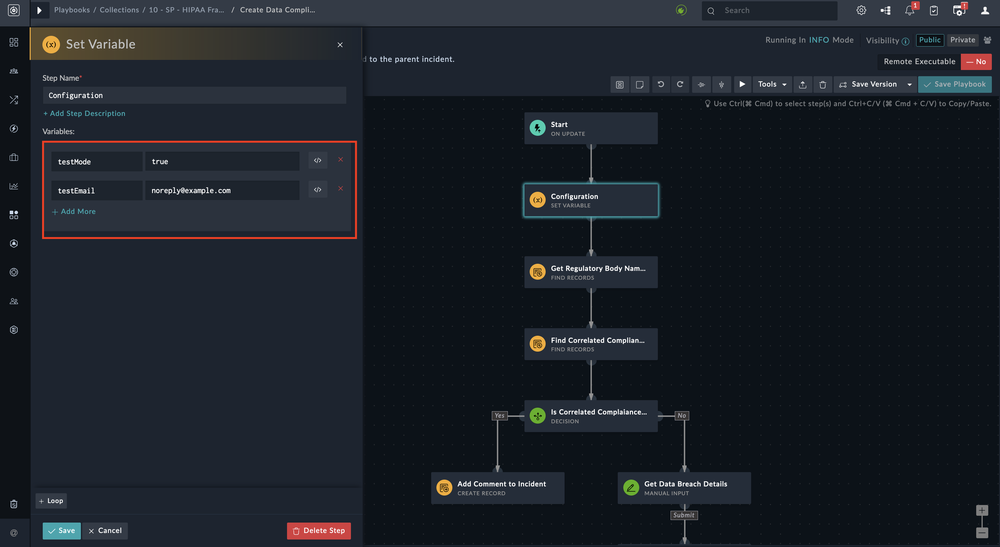
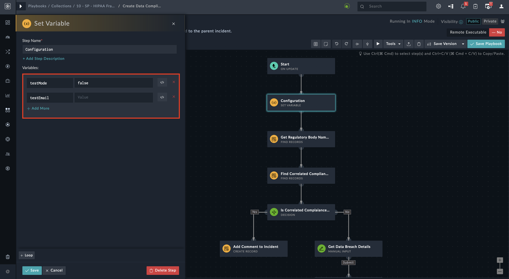

[Home](../README.md) |
|--------------------------------------------|

# Installation

1. To install a solution pack, click **Content Hub** > **Discover**.
2. From the list of solution pack that appears, search for **HIPAA Framework**.
3. Click the **HIPAA Framework** solution pack card.
4. Click **Install** on the lower part of the screen to begin the installation.

## Prerequisites

The **HIPAA Framework** solution pack depends on the following solution packs that are installed automatically &ndash; if not already installed.

| Solution Pack Name | Version | Purpose                                                                                                                                                                                            |
|:-------------------|:--------|:---------------------------------------------------------------------------------------------------------------------------------------------------------------------------------------------------|
| SOAR Framework     | v2.0.0  | <ul><li>Required for Incident Response modules and Action playbooks</li><li>Required for "Was personal data affected?" field which acts as a trigger point for HIPAA Framework Playbooks</li></ul> |

# Configuration
For optimal performance of **HIPAA Framework** solution pack, configure **Code Snippet** connector to extract and build an address book of geo-specific regulatory bodies and their contacts.

- To configure **Code Snippet** connector, refer to [Configuring Code Snippet](https://docs.fortinet.com/fortisoar/connectors/codesnippet) connector document.

<table>
    <tr>
        <td><strong>NOTE</strong></td>
        <td>The connector comes pre-installed and hence needs only configurations.</td>
    </tr>
</table>

## Playbook Execution Modes

You can execute the HIPAA playbooks in *Test Mode* as well as in *Production Mode*

- The playbooks are by default configured to execute in *Test Mode*
  - The *Test Mode* uses a test email address for all email communication towards HIPAA Security Officer (HSO), affected individuals, or Law Enforcement Agency
  - The *Production Mode* uses the actual email addresses of relevant authorities and stakeholders

<table>
    <tr>
        <th>WARNING</th>
        <td>Please be careful with the email addresses you use, as data breach notification emails are sent to these addresses. Hence, while in <em>Test</em> mode, do not use actual DPO and DPA email addresses.</td>
    </tr>
</table>

### Test Mode

To change the execution mode to *Test* make the following changes:

1. Go to the *Create Data Compliance Record* playbook under the **10 - SP - HIPAA Framework** collection and open the *Configuration* step

    

2. Modify the value of the `testMode` variable to `true`.

3. Change the value of the `testEmail` variable to a valid email address capable of receiving all HIPAA email notifications.

    <table>
        <tr>
            <th>WARNING</th>
            <td>When in <em>Test</em> mode, ensure that the value of the <code>testEmail</code> variable is not empty.</td>
        </tr>
    </table>

    

### Production Mode

To change the execution mode to *Production* make the following changes:

1. Go to the *Create Data Compliance Record* playbook under the **10 - SP - HIPAA Framework** collection and open the *Configuration* step

    

2. Modify the value of the `testMode` variable to `false`.

3. Keep the `testEmail` variable blank.

    

## Check for SLA Violation Playbook

This playbook sends progressive SLA breach reminder emails. To set threshold values for reminder notifications, make the following configuration changes:

1. Goto **Check for SLA violation** Playbook and open the *Configuration* step.

2. The reminder threshold value is in hours. Change values of the following variables

    - `firstReminderSLA`: The default value is 24 Hours which means the first reminder is sent when the SLA time remaining is less than 24 hours left.

    - `secondReminderSLA`: The default value is 4 Hours which means the second reminder is sent when the SLA time remaining is less than 4 hours left.
        

A third and final reminder, of the SLA breach, is sent after the completion of 60 days.

# Next Steps
| [Usage](./usage.md) | [Contents](./contents.md) |
|---------------------|---------------------------|