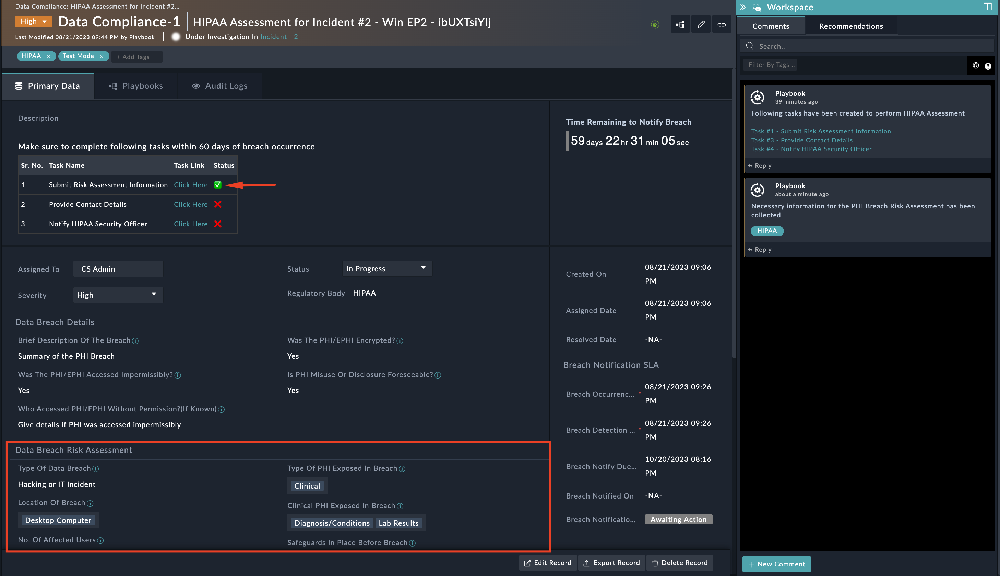
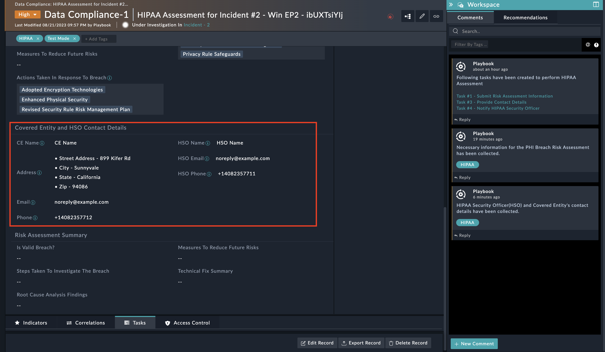

| [Home](../README.md) |
|----------------------|

# Usage

<table>
    <tr>
        <th>WARNING</th>
        <td>If you have GDPR Solution Pack already installed in your system then make sure inactivate the playbook <strong>10 - SP - GDPR Framework > Create Data Compliance Record</strong></td>
    </tr>
</table>

**HIPAA Framework** solution pack helps users track and follow the guidelines provided in the [*Breach Notification Rule*](https://www.hhs.gov/hipaa/for-professionals/breach-notification/index.html), in the event of a breach of unsecured PHI/ePHI. As per the guidelines, it is mandatory to notify individuals, the relevant federal agency, and in some cases, the local media.

## Gathering Details on Protect Health Information (PHI) Breach

1. When a Protect Health Information (PHI) breach is detected in an incident, choose the value of **Was Personal Data Affected?** field as **Yes**.

    

2. A pop-up appears that collects additional information related to the incident

    <table>
        <tr>
            <th>NOTE</th>
            <td>When playbooks are executed in <code>Test</code> mode, the <strong>Green</strong> icon shown in the following screenshot appears in all the tasks related to this solution pack.
            

            
Similarly, when playbooks are executed in <code>Production</code> mode, a <strong>Red</strong> icon shown in the following screenshot appears

            

            
            </td>
        </tr>
    </table>

3. Select **HIPAA** in **Regulatory Body** and provide the required information

    

4. A New Data Compliance Record, dedicated to HIPAA Assessment and the corresponding task, is created. The same is updated in the Incident comments.

    

### HIPAA Assessment Data Compliance Record

- Open the newly created HIPAA Data Compliance Record; the corresponding tasks appear in the Description field and the task tabs. The tasks need to be completed within 60 Days.

- The Data Compliance Record is also updated with additional details and starts showing up the remaining time to notify the PHI/ePHI breach.

    

## Submit Risk Assessment Information

1. Open the task and click the **Submit Risk Assessment Information** button.

    

2. Enter the Risk Assessment details in the pop-up that appears.

    

3. Details provided by HSO are reflected in the created data compliance record as shown, and the task is marked as complete.

    

## Provide HSO (HIPAA Security Officer) and CE (Covered Entity) Contact Details

1. Open the task and click the **Provide Contact Details** button.

2. Similarly, Collect HSO and CE contact details under **Provide Contact Details** Task

    

3. Details provided reflect in the created data compliance record as shown, and the task is marked as complete

    

## Notify HIPAA Security Officer

1. Open the task and click the **Notify HIPAA Security Officer** button. This sends an email to the HSO.

2. The HSO clicks the link in the email to review and approve the information shown on the following screen.

    
  
3. Details provided by HSO are reflected in the created data compliance record as shown, and the task is marked as complete

    

Based on the inputs from HSO, new tasks may be created. The following flow diagram explains when a new task is created:

## Perform Actions to Apply Technical Fix

1. Open the task and click the **Apply Technical Fix** button.
2. Submit the Technical fix details under this task.

    

3. The technical fix details provided will reflect in the created data compliance record as shown, and the task is marked as complete

    

## Notify Breach to the Secretary of HHS

1. Open the task and click the link provided in the task description to notify the Secretary of HHS about the PHI breach.
2. Once the Secretary of HHS is notified about the breach, mark this task as `Completed`.

## Report Breach to Law Enforcement Agency

This task is created to report a breach to the law enforcement Agency of PHI breach.

1. Open the task and click the **Report Law Enforcement Agency** Button and provide the email address of the law enforcement agency as shown in the following screenshot.

    

2. This task generates the following report and sends it to the law enforcement agency

    

3. Once the report is sent to the law enforcement agency then the task is marked as Completed and a new task to `Confirm Law Enforcement's Notification Delay Request` will be created.

<table>
    <tr>
        <th>WARNING</th>
        <td>Ensure that you are not sending any confidential or personal information of the affected individuals while reporting a PHI brach to the law enforcement agency.</td>
    </tr>
</table>

## Confirm Law Enforcement's Notification Delay Request

This task is created to confirm if law enforcement requested a delay in notifying the breach to affected individuals. 

The delay may be requested by law enforcement officials if notifying about the breach impedes their investigation.

1. Open the task and click the **Confirm Delay Request Status** Button and provide an appropriate response.

    

2. If the law enforcement agency has requested a delay then; 
    - The task is marked as **On Hold/Blocked**
    - The SLA is paused for the Data Compliance record created for the breach

        

    - Mark this Task **Completed** once the law enforcement agency has given the go-ahead to notify individuals affected by the breach.

## Compile List of Affected Individuals

This task compiles a list of individuals who have been affected by the breach.

1. Open the task and click the **Upload Affected Users List** button.
2. Upload the affected user's contact details in CSV format, this creates Contact records for each user.

    

3. The following is a sample CSV file.

    [Sample CSV File](./res/sample-user-list.csv)

4. Once User's contacts are uploaded and contact records created, the task is marked as **Completed**.

<table>
    <tr>
        <th>NOTE</th>
        <td>Contact details of individuals fall under sensitive information and is stored in FortiSOAR as contact records. This information, specifically email addresses, is used to notify individuals about the PHI breach.</td>
    </tr>
</table>

## Notify Affected Users

1. Open the task and click the **Notify Affected Individuals** button
2. The notification should contain the following information
    - **What happened?** - Provide brief information on data breach
    - **What Information Was Involved?** - Provide information on what type of data was compromised
    - **What Are We Doing?** - Provide remediation/mitigation action taken or planned
    - **What You Can Do?** - Provide advisory to the user about actions to be taken to minimize the risk

        

3. Review the email content before sending the mail

    

## Provide Substitute Notice

1. If the contact information of affected individuals is outdated and the HSO opts to send a substitute notice in the *Notify HIPAA Security Officer* task, this new task is created. This task notifies affected users using alternative methods like written forms, telephone, or other means for those with outdated contact details.

2. Once the individuals are notified using substitute methods, mark this task as **Completed**.

## Provide Media Notice

1. This task is created only if more than 500 individuals were affected by the breach. In such a case, the covered entity is required to provide notice to prominent media outlets. 

2. Once the media notice is provided, mark this task as **Completed**.

# Next Steps

| [Installation](./setup.md#installation) | [Configuration](./setup.md#configuration) | [Contents](./contents.md) |
|-----------------------------------------|-------------------------------------------|---------------------------|